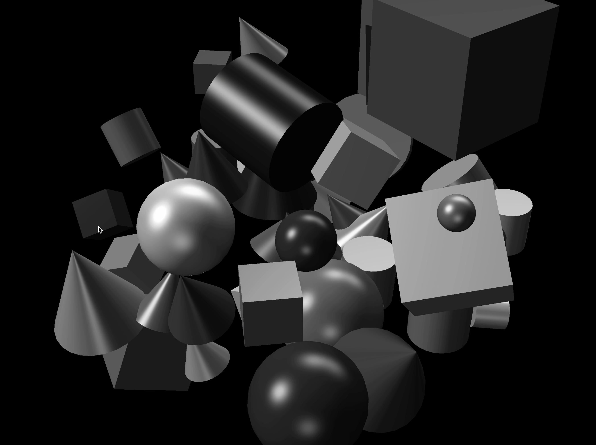
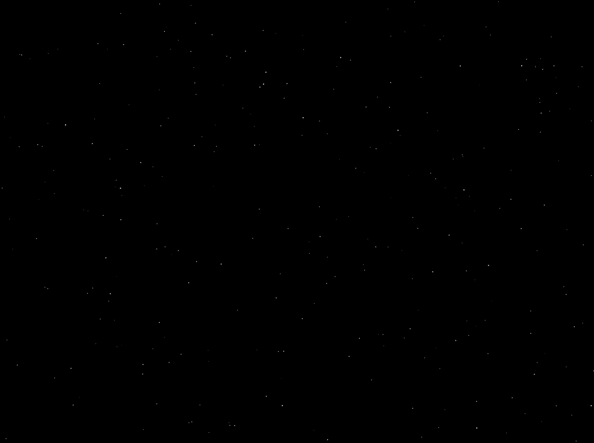
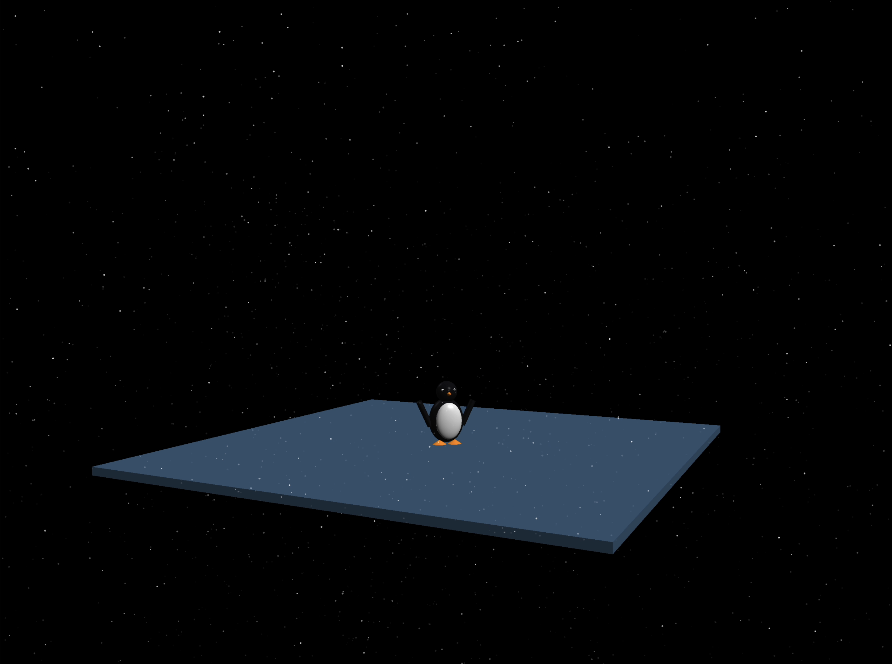
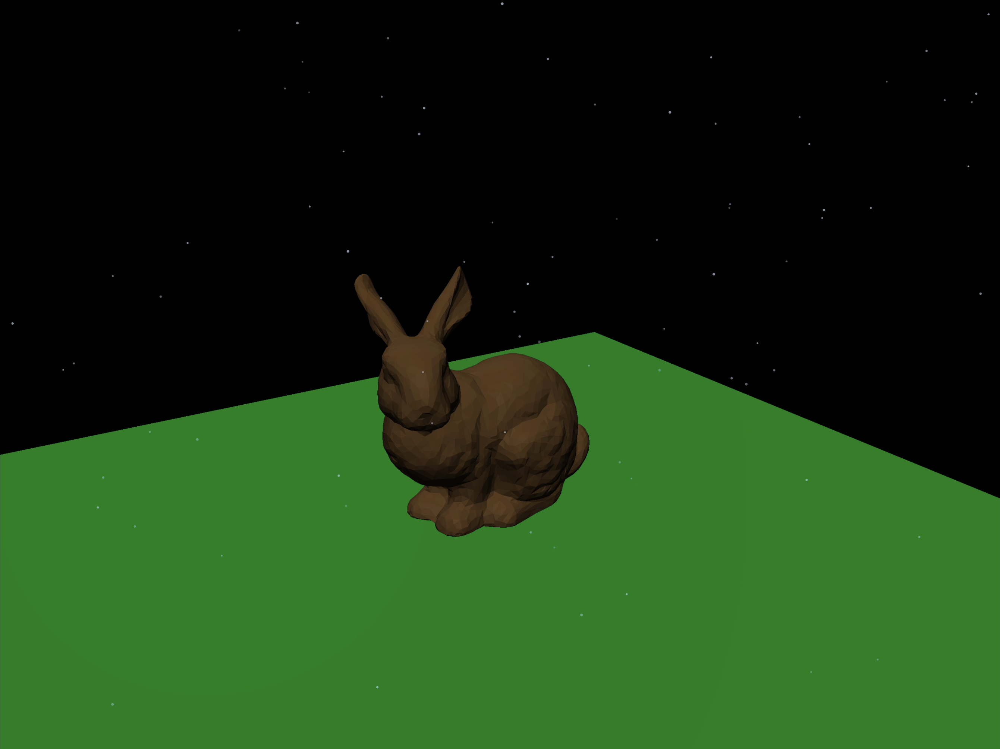
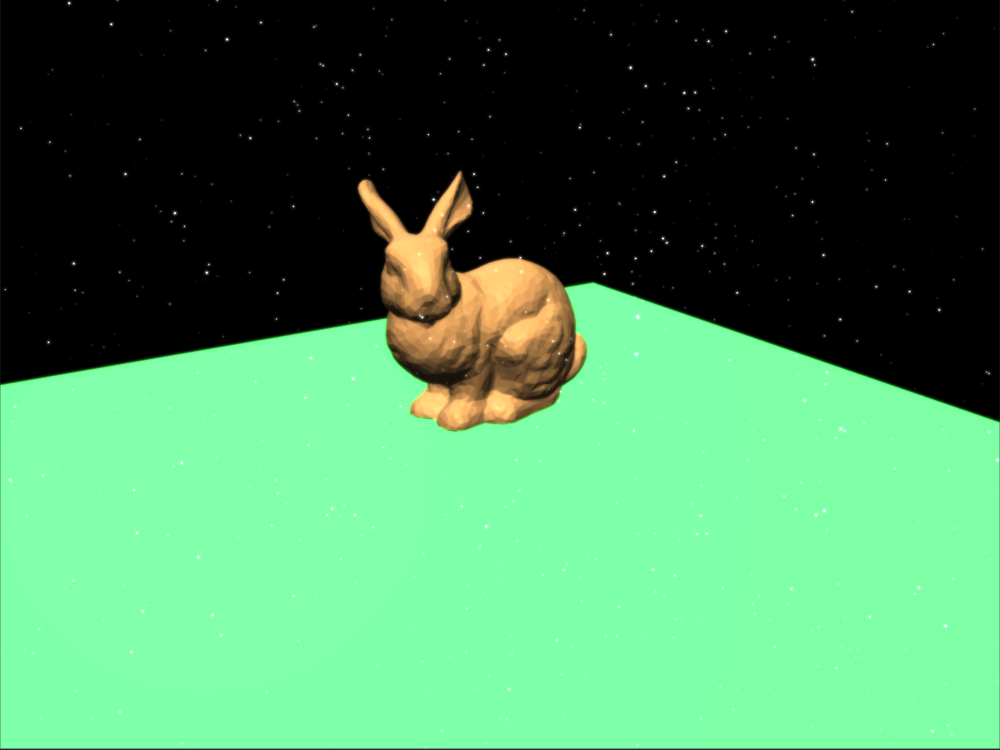
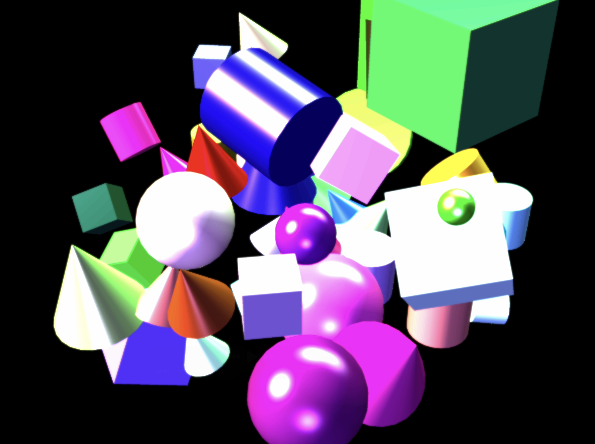
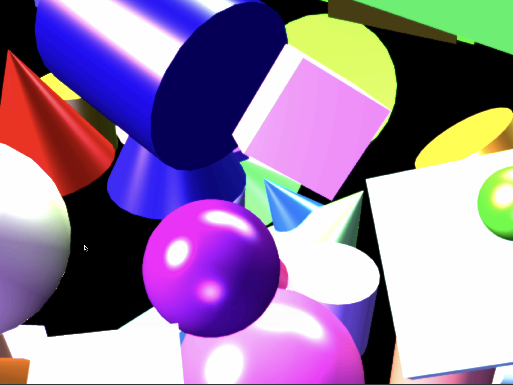

## Project 6: Final Project Gear Up

The project handout can be found [here](https://cs1230.graphics/projects/final/gear-up).

### Project 6: The Four Seasons Overview
This project is a real time scene viewer and effects sandbox built on top of the Project 5 realtime renderer, extended
to support seasonal atmosphere through full screen post processing and a GPU rendered particle system. The program 
parses JSON scenefiles into a flat RenderData structure containing camera data, global lighting coefficients, lights, 
and transformed shapes, tessellates analytic primitives into triangles, uploads interleaved vertex buffers to the GPU, 
and draws the scene with a standard model view projection pipeline and Phong shading. On top of the base renderer, I 
added an offscreen framebuffer based post pipeline so the scene can be rendered once and then composited with fullscreen 
effects, and I integrated a particle overlay that is rendered into the same pass so post effects and screenshot capture 
apply to particles as well!

### Features
#### Post-Processing Pipeline (⭐⭐)
Post processing is implemented as a two pass pipeline inside the PostProcess class. In the first pass, the renderer binds
an internal framebuffer object (FBO) with an RGBA8 color texture attachment and a depth renderbuffer, sets the viewport to 
match the current target size, enables depth testing and face culling, clears, and then renders the full 3D scene into this
offscreen target. In the second pass, the renderer composites the offscreen color texture to whatever framebuffer is 
currently bound, either the on-screen default framebuffer or the screenshot framebuffer used by saveViewportImage, by 
drawing a fullscreen quad and sampling the offscreen texture in a post fragment shader. The shader supports multiple modes 
selected by a uniform (passthrough, invert, grayscale), and the pipeline is guarded by PostProcess::ready so the program can
safely fall back to direct rendering if the postprocess resources are not initialized!

##### Post-Processing Pipeline: Proof of Funtionality
To demonstrate that the post-processing pipeline is functioning beyond simple passthrough, I implemented a keyboard-controlled
grayscale mode toggle. In Realtime::keyPressEvent, pressing G switches m_postMode between 0 (normal) and 2 (grayscale), and the 
next frame is composited through PostProcess::endToTarget using that mode value. This provides a clear interactive verification 
that the scene is being rendered into the offscreen framebuffer first, then re-rendered to the screen through the fullscreen post 
shader, since the grayscale conversion only occurs during the second-pass fullscreen composite and can be turned on and off live 
without restarting.

| Demo |
| :--: |
|  |

#### Particle System (⭐⭐⭐)
The particle system is implemented as a CPU simulated, GPU rendered point sprite pipeline that is driven by a configurable 
mitter preset. Simulation runs every frame in timerEvent using a deltaTime computed from a QElapsedTimer, updating per 
particle position, velocity, acceleration, drag, lifetime, and color interpolation, while rendering happens in paintGL using
the same view and projection matrices as the 3D scene so particles remain correctly placed in world space. Particles are 
rendered as GL_POINTS using a dedicated particle shader pair, where the vertex shader transforms each particle and sets 
gl_PointSize from a per particle size attribute and the fragment shader uses gl_PointCoord to create a circular sprite with 
a soft edge by discarding fragments outside a radius and fading alpha near the boundary. A key detail about the particles is that 
particles are drawn before the postprocess composite step, so post processing affects particles and screenshots taken through 
saveViewportImage include the particle overlay! In addition, the particle system is reset on sceneChanged so particles from one 
scenefile do not carry over into the next.

##### Particle System: Proof of Funtionality

| Particle: No Scene | Particle: With Scene |
|---|---|
|  |  |

| Particle: Movement | Particle: With Bloom |
|---|---|
|  |  |

#### Qt Resources and Shader Loading
Shaders are loaded through Qt resource paths (for example, ":/resources/shaders/particle.vert"). To ensure particle 
shaders and post shaders are actually found at runtime, the project uses a resources.qrc file that packages shader 
files into the binary under the "/resources" prefix. This fixes the failure mode where the particle system reports 
nonzero alive particles but cannot render because the shader program and GL buffers were never created due to missing
resource files.

### Extra Credit
#### Screen Space Bloom (⭐⭐)
Screen space bloom is implemented as an optional post process path that is toggled through Extra Credit 2 in settings and runs 
within the same two pass rendering structure. When bloom is enabled, the pipeline first performs a bright pass that extracts 
high intensity regions from the rendered scene texture into a separate bloom texture, then applies a separable blur using a ping
pong pair of framebuffers to diffuse those bright regions across neighboring pixels, and finally combines the blurred bloom 
result back with the original scene in a fullscreen combine shader. Bloom strength is controlled with a UI slider that updates a 
scalar multiplier passed into the combine shader, allowing the user to tune the intensity of the glow effect at runtime without 
restarting the application. The renderer also checks bloom readiness and falls back to normal passthrough compositing if bloom 
resources or uniforms are not available, which avoids breaking rendering when bloom is toggled. 

#### Screen Space Bloom: Proof of Functionality

| Bloom: Functionality | Bloom: Movement |
|---|---|
|  |  |

#### Extra Credit Points Attempted
##### ⭐⭐ = 40 Points

I attempted to implement the screen space bloom feature into this project, which is worth two stars, or 40 points.

### Collaboration/References
- Built on the Project 5 realtime renderer and Brown CSCI 1230 starter/framework code (SceneParser/RenderData pipeline, Qt realtime
app structure, provided scenefiles).

- Used course-provided Qt + OpenGL patterns (QOpenGLWidget render loop, Qt resource system via .qrc, shader loader utilities) and 
class notes/handouts as reference for framebuffer-based postprocessing and fullscreen quad compositing.

### Known Bugs
- Bloom is tuned for LDR output and can look subtle depending on the scene’s brightness and materials; scenes without strong 
highlights may show little to no visible glow unless bloom strength is increased.

- Particle visibility is scene-dependent: if the camera starts inside geometry or the scene is extremely large/small relative 
to the clip planes, the emitter region may place particles outside the most visible area until the camera is moved.

### Time Spent
- Post-Processing Pipeline: ~3 hours
- Particle System: ~5 hours
- Screen Space Bloom (bright pass, blur, combine, tuning): ~8 hours
- UI/Settings Wiring: ~2 hours
- Debugging/Polish: ~4 hours
- Total: ~22 hours
